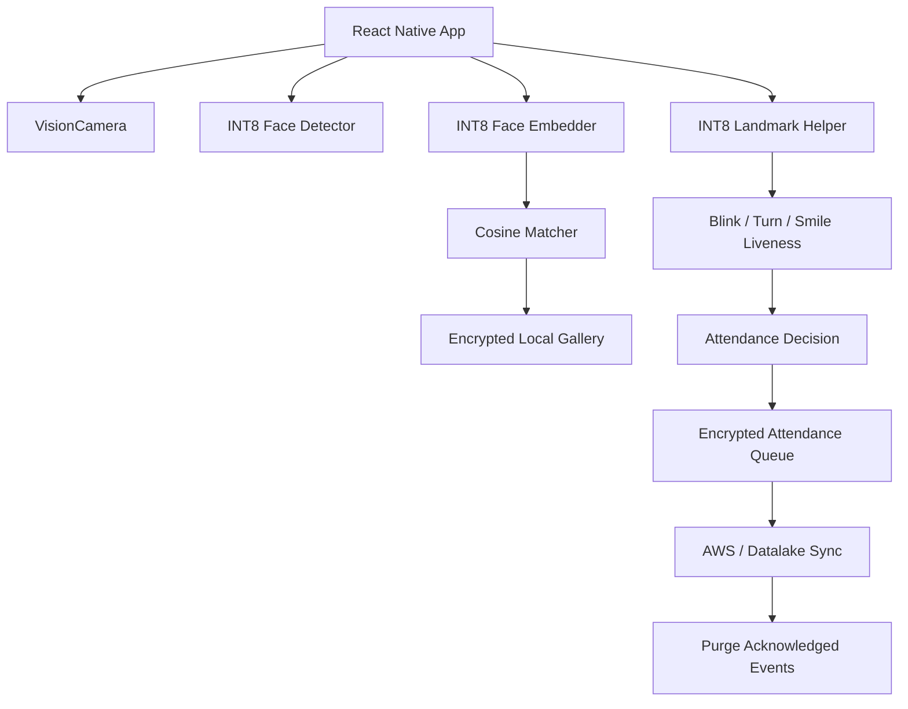
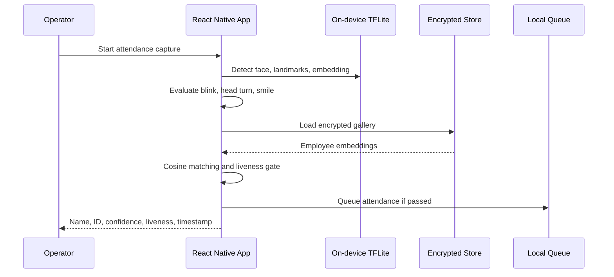
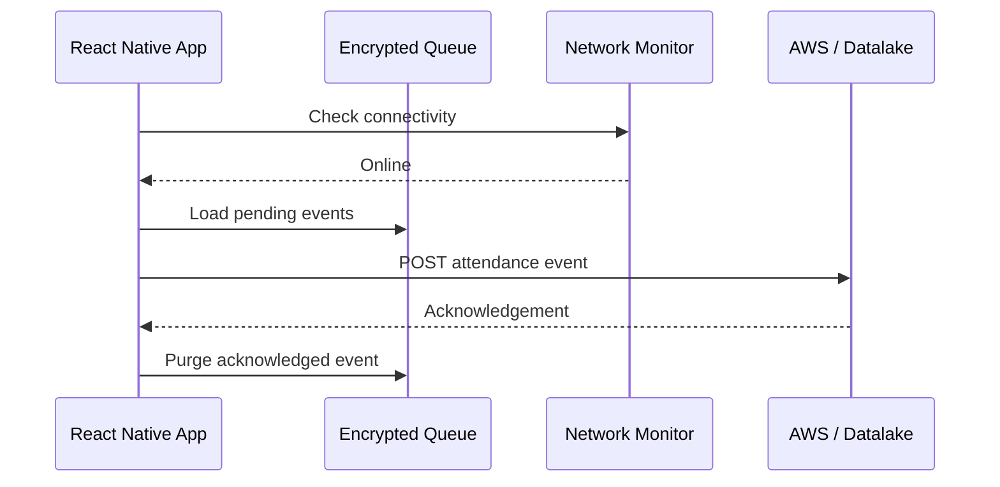

# System Design Diagrams

## Component Diagram

```mermaid
flowchart TB
  App["React Native App"] --> Camera["VisionCamera"]
  App --> Detector["INT8 Face Detector"]
  App --> Embed["INT8 Face Embedder"]
  App --> Landmark["INT8 Landmark Helper"]
  Landmark --> Live["Blink / Turn / Smile Liveness"]
  Embed --> Matcher["Cosine Matcher"]
  Matcher --> Store["Encrypted Local Gallery"]
  Live --> Decision["Attendance Decision"]
  Decision --> Queue["Encrypted Attendance Queue"]
  Queue --> Sync["AWS / Datalake Sync"]
  Sync --> Purge["Purge Acknowledged Events"]
```

## Recognition Sequence

```mermaid
sequenceDiagram
  participant O as Operator
  participant App as React Native App
  participant AI as On-device TFLite
  participant Store as Encrypted Store
  participant Queue as Local Queue
  O->>App: Start attendance capture
  App->>AI: Detect face, landmarks, embedding
  App->>App: Evaluate blink, head turn, smile
  App->>Store: Load encrypted gallery
  Store-->>App: Employee embeddings
  App->>App: Cosine matching and liveness gate
  App->>Queue: Queue attendance if passed
  App-->>O: Name, ID, confidence, liveness, timestamp
```

## Sync Sequence

```mermaid
sequenceDiagram
  participant App as React Native App
  participant Queue as Encrypted Queue
  participant Net as Network Monitor
  participant DL as AWS / Datalake
  App->>Net: Check connectivity
  Net-->>App: Online
  App->>Queue: Load pending events
  App->>DL: POST attendance event
  DL-->>App: Acknowledgement
  App->>Queue: Purge acknowledged event
```
